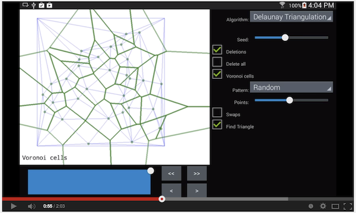

# geometry

An Android app for developing 2D algorithms, using OpenGL.  It has an 'algorithm stepper' feature, which
lets you step through an algorithm, to aid in testing and debugging.

---

Here's a screenshot of the algorithm stepper in action, where the task is to triangulate a polygon:

