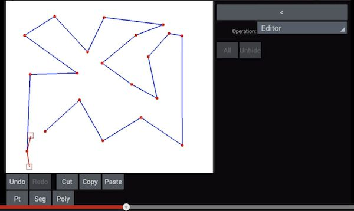

# geometry

This is an Android application framework for developing 2D algorithms, using
OpenGL.  It has an 'algorithm stepper' feature, which lets you step through an
algorithm,  to aid in testing and debugging.

The video shows an example app that implements three algorithms: a dynamic
Delaunay triangulation, a star-shaped polygon triangulation, and a general
(simple) polygon triangulation.

---

Here's a video of the algorithm stepper in action:

---

Here's a video showing the editor component of the framework:

---

Here's a video showing the new gesture panel, which allows a user to enter gestures
within the rounded rectangle which are mapped to particular buttons:

